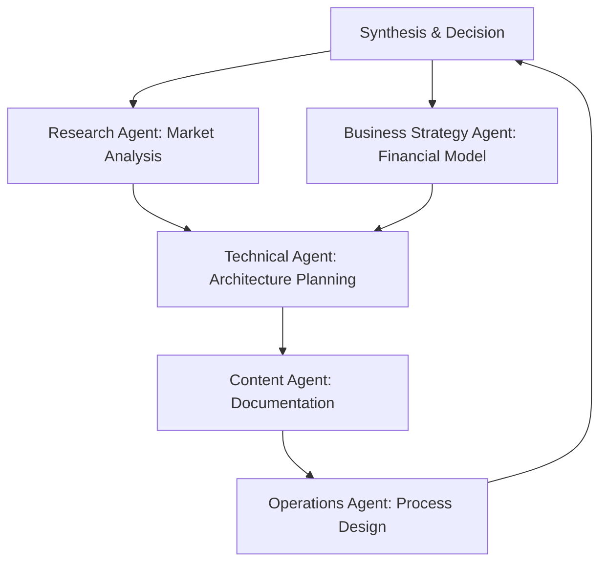

# 🤖 Subagent Integration Strategy

> **Leveraging Claude Code's Specialized Agents for Enhanced Cognitive Partnership**

## 🎯 Strategic Overview

Transform Cymatic OS from a single-assistant system into a **multi-agent cognitive ecosystem** that leverages Claude Code's specialized subagents for different cognitive functions while maintaining unified context and identity alignment.

## 🏗️ Agent Architecture

### **Master Coordinator (Primary Cymatic OS)**
- **Role**: Central context manager and decision orchestrator
- **Functions**: 
  - Maintains Personal Knowledge Vault
  - Executes DRIVE framework coordination
  - Routes tasks to appropriate subagents
  - Ensures authenticity alignment across all agent interactions
  - Synthesizes multi-agent outputs into coherent recommendations

### **Specialized Subagent Roles**

#### **1. Research & Analysis Agent**
```yaml
Trigger: Market research, competitive analysis, technical research
Use Cases:
  - Primary offer market expansion research
  - Local market conditions and pricing optimization  
  - Template product target audience analysis
  - Technology stack evaluation for new projects
Context Sharing: Market findings, competitive landscapes, trend analysis
```

#### **2. Technical Architecture Agent**  
```yaml
Trigger: System design, code review, technical decision-making
Use Cases:
  - Client portal architecture decisions
  - Database schema optimization across projects
  - API design and integration planning
  - Security and scalability assessments
Context Sharing: Technical specifications, architecture decisions, performance metrics
```

#### **3. Business Strategy Agent**
```yaml
Trigger: Financial modeling, business planning, strategic decisions
Use Cases:
  - Revenue stream optimization across project portfolio
  - Market expansion planning for the primary offer
  - Investment prioritization and resource allocation
  - Partnership and acquisition opportunity analysis
Context Sharing: Financial models, strategic plans, growth metrics
```

#### **4. Content & Communication Agent**
```yaml
Trigger: Documentation, marketing, educational content creation
Use Cases:
  - Client portal user documentation and tutorials
  - Template product marketing materials and positioning
  - Technical blog posts and thought leadership
  - Investor presentations and pitch materials  
Context Sharing: Brand voice, messaging frameworks, content calendars
```

#### **5. Operations & Automation Agent**
```yaml
Trigger: Process optimization, system automation, workflow design
Use Cases:
  - Operations workflow optimization
  - Customer onboarding automation for the primary offer
  - Cross-project task management and scheduling
  - Quality assurance and testing protocols
Context Sharing: Process maps, automation scripts, efficiency metrics
```

## 🔄 Agent Coordination Workflows

### **Project Initiation Workflow**


### **Daily Operations Workflow**
```yaml
Morning Activation:
  1. Master Coordinator: Review Knowledge Vault, set daily priorities
  2. Research Agent: Monitor market conditions, competitor updates
  3. Operations Agent: Check system health, process efficiency
  4. Business Agent: Review revenue metrics, opportunity assessment
  
Work Session Support:
  - Master Coordinator routes specific tasks to appropriate agents
  - Agents provide specialized insights within their expertise
  - Master maintains authenticity checks and pattern recognition
  
Evening Synthesis:  
  - All agents report key findings to Master Coordinator
  - Master updates Knowledge Vault with integrated learnings
  - Pattern recognition across all agent interactions
```

## 🧠 Context Sharing Mechanisms

### **Shared Knowledge Base**
```yaml
Personal Knowledge Vault:
  - Identity Profile (shared read-only with all agents)
  - Current State (updated by Master, read by all)
  - Project Status (updated by relevant agents)
  - Behavioral Patterns (Master coordinates pattern recognition)

Agent-Specific Knowledge:
  - Research Agent: Market intelligence database
  - Technical Agent: Architecture decisions and technical debt log  
  - Business Agent: Financial models and strategic frameworks
  - Content Agent: Brand guidelines and messaging frameworks
  - Operations Agent: Process maps and automation scripts
```

### **Cross-Agent Communication Protocols**
```yaml
Agent Handoffs:
  - Include relevant context summary from Personal Knowledge Vault
  - Reference previous agent outputs when building on prior work
  - Flag authenticity concerns or pattern triggers
  - Update Master Coordinator on key decisions or insights

Conflict Resolution:
  - Master Coordinator mediates when agents provide conflicting advice
  - Authenticity alignment takes precedence over optimization
  - User input required for high-impact decisions affecting core values
```

## ⚡ Smart Command Evolution

### **Enhanced Commands with Subagent Integration**

#### **`::market_research`**
```yaml
Trigger: Need market intelligence or competitive analysis
Action: Deploy Research Agent with specific parameters
Context: Include current project focus, target markets, key questions
Output: Comprehensive market brief integrated with current strategy
```

#### **`::technical_review`**
```yaml
Trigger: Architecture decisions or technical challenges
Action: Deploy Technical Agent with current system context
Context: Existing tech stack, performance requirements, constraints
Output: Technical recommendations aligned with overall project goals
```

#### **`::revenue_optimization`**
```yaml
Trigger: Financial performance review or new opportunity evaluation
Action: Deploy Business Strategy Agent with current portfolio context
Context: Current revenue streams, growth targets, resource constraints
Output: Prioritized recommendations with financial projections
```

#### **`::content_sprint`**
```yaml
Trigger: Need for marketing materials, documentation, or thought leadership
Action: Deploy Content Agent with brand voice and current messaging
Context: Target audience, key messages, content format requirements
Output: Draft content aligned with brand and strategic goals
```

#### **`::process_audit`**
```yaml
Trigger: Workflow inefficiencies or automation opportunities
Action: Deploy Operations Agent with current process maps
Context: Pain points, time constraints, quality requirements
Output: Optimized workflows with automation recommendations
```

## 🎯 Implementation Strategy

### **Phase 1: Single-Agent Enhancement (Immediate)**
- Implement Research Agent for primary offer market expansion
- Use Business Strategy Agent for template product monetization optimization
- Test Technical Agent for architecture decisions

### **Phase 2: Multi-Agent Coordination (Short-term)**
- Develop Master Coordinator routing logic
- Implement context sharing protocols between agents
- Create unified reporting and synthesis workflows

### **Phase 3: Autonomous Orchestration (Long-term)**
- Proactive agent deployment based on pattern recognition
- Cross-agent learning and capability enhancement
- Predictive task routing and resource optimization

## 📊 Success Metrics

### **Effectiveness Indicators**
- **Context Retention**: Reduced need to re-explain background across sessions
- **Decision Speed**: Faster resolution of complex, multi-faceted challenges  
- **Quality Enhancement**: Higher quality outputs through specialized expertise
- **Cognitive Load Reduction**: Less mental energy spent on context switching

### **Integration Success Measures**
- **Cross-Agent Coherence**: Consistent recommendations across different agents
- **Authenticity Maintenance**: All agent outputs align with core values
- **Process Efficiency**: Reduced time from question to actionable recommendation
- **Learning Acceleration**: Faster skill development through specialized agent expertise

---

**Implementation Priority**: High - Addresses core context fragmentation challenge  
**Next Steps**: Begin with Research Agent integration for current primary offer expansion planning  
**Review Cycle**: Weekly agent effectiveness assessment, monthly strategy optimization
